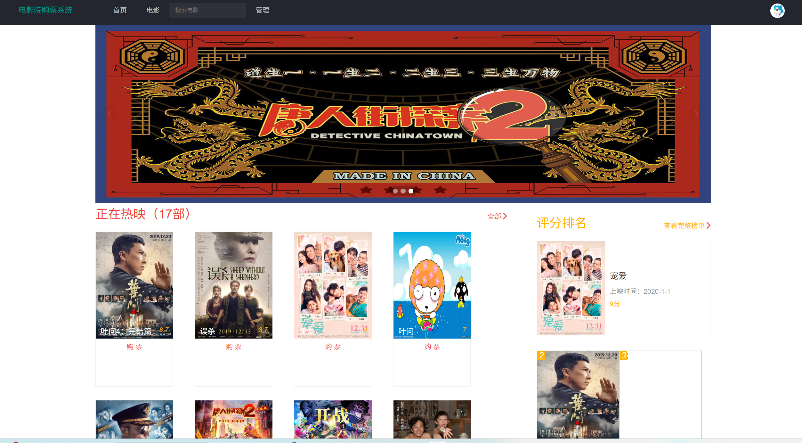
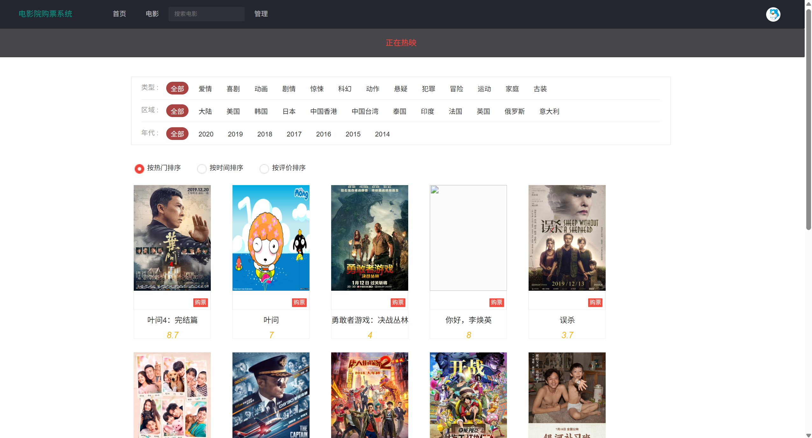
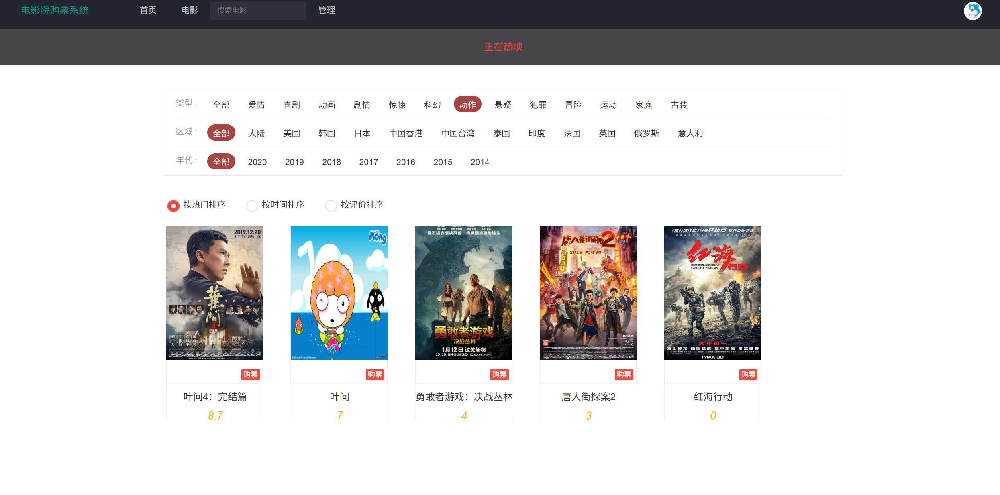
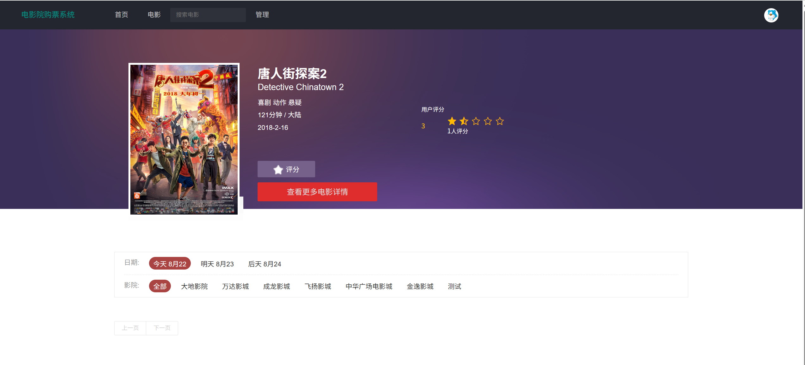
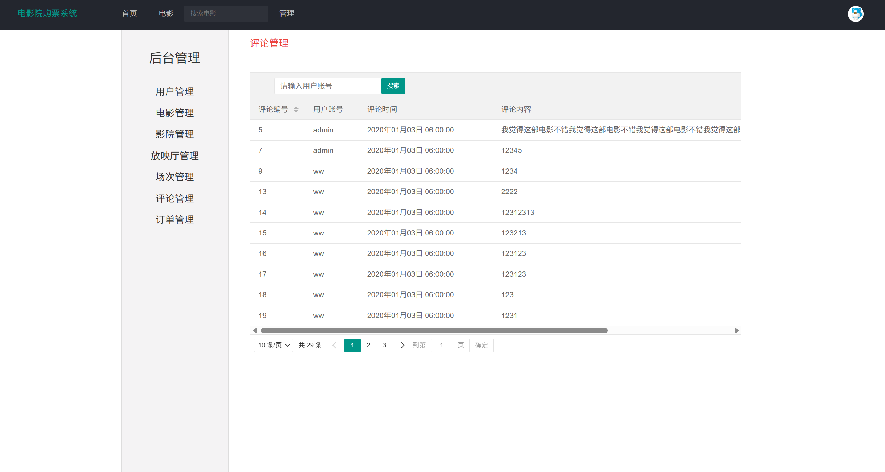
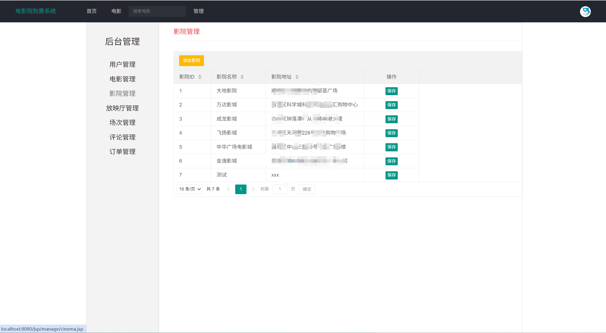
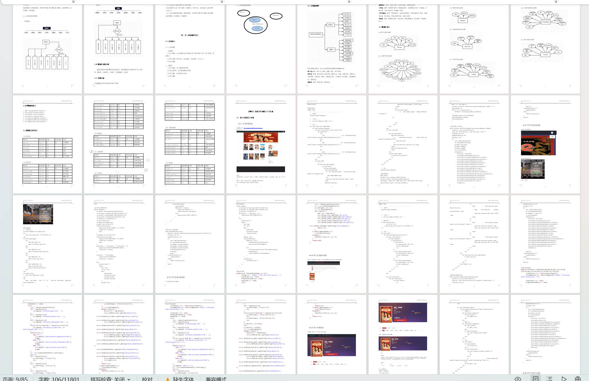

# jspServlet012
jspServlet012电影院订票管理系统+BG
 
## 查看主页获取源码

### 一、关键词

电影院购票系统，电影院管理系统

### 二、作品包含
源码+数据库+设计报告文档+全套环境和工具资源+本地部署教程

### 三、项目技术
前端技术：Html、Css、Js、Jquery
后端技术：Java、JSP、Servlet、JDBC

### 四、运行环境（以下版本亲测，其他版本兼容性请自行测试）
开发工具：IDEA/eclipse

数据库：MySQL5.7或8.0

服务器：Tomcat8.5或Tomcat9.0

数据库管理工具：Navicat10以上版本

环境配置软件： JDK1.8

浏览器：谷歌浏览器

### 五、项目介绍
项目编号：jspServlet012

伴随着网络的蓬勃发展和不断普及，以及电影的拍摄技术与视觉效果都在不断提升,人们走入电影院看电影已是越来越普便.但由于种种原因，人们没有时间到电影院排队买票。网上影院订票系统就是为了达到这个目的而进行设计并实现的。

用户信息管理：用户注册后，可修改个人信息、登录密码等
影片分类：对影片进行分类，按类型、国家区域分类，有筛选功能
影片的信息：（影片的名称、导演、演员、简介及上映时间等）
按价格查询票源；不同影院价格不同
按时间查询票源；
影片的推荐：可根据影片好评度或售票量进行推荐，推荐好评度高或售票量高电影
观影的房间、座位的选择：用户选择观影的影院、房间、座位，用户不能选择已出售的座位
影片的好评度（标准）； 用户登录后可对影片进行评分，总共5星，一颗星两分
用户的评价：用户登录后可对影片写一些评价
影片的下单：用户登录后，进行影片、影院、时间、座位等选择后，可以下单购买电影票
订单信息查询
     用户登录后，可查询自己之前的历史订单信息，包括金额、对应电影票、场次、座位等
如何成为会员（享受什么优惠）
     用户可浏览订票网站展示的影片和影片讯息，但用户需注册登录后才能进行订票，用户分普通用户和会员，会员可享受一定的优惠（普通用户怎么成为会员？会员享受怎么的优惠？）

系统后台，管理员功能
管理员可对影片分类进行管理，管理影片的类型、区域等
管理员可对影片的信息进行管理，包括影片的名称、导演、演员、简介及上映时间等，对影片进行新增、删除、编辑等。
管理员可对影评信息进行管理，对评语进行审核、删除等。
管理员可对所有电影院中影片价格进行修改
管理员具有对用户信息进行查询、修改等管理功能。
管理员可修改管理员登录密码	
管理员可对电影票订单信息进行查询和管理的操作

### 六、运行截图

